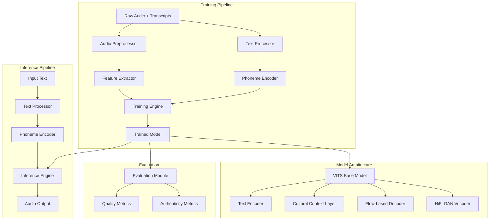

# Design Document: Kaka TTS

## Overview

Kaka TTS is a specialized Text-to-Speech system that generates authentic Telangana slang speech. The system architecture follows a standard neural TTS pipeline with custom enhancements for regional dialect preservation. The core approach involves fine-tuning a pre-trained VITS (Variational Inference with adversarial learning for end-to-end Text-to-Speech) model on 100+ hours of Telangana slang audio data, augmented with a Cultural Context Layer that captures regional phonetic and prosodic patterns.

The system consists of three main phases:
1. **Training Phase**: Preprocessing audio data, extracting features, and fine-tuning the model
2. **Inference Phase**: Converting input text to authentic Telangana slang speech
3. **Evaluation Phase**: Measuring quality and regional authenticity

### Key Design Decisions

- **Base Model Selection**: VITS is chosen for its end-to-end architecture that jointly trains acoustic and vocoder components, eliminating the need for separate mel-spectrogram and waveform generation stages
- **Fine-tuning Strategy**: Transfer learning from a pre-trained model reduces training time and data requirements while maintaining high quality
- **Cultural Context Layer**: A specialized attention-based module inserted into the VITS architecture to capture regional linguistic features
- **Training Infrastructure**: AWS g5.2xlarge instances with mixed precision training to stay within $1,200 budget

## Architecture

The Kaka TTS system follows a modular architecture with clear separation between data processing, model training, and inference components.



### Component Interaction Flow

**Training Flow**:
1. Audio Preprocessor normalizes and segments raw audio files
2. Feature Extractor generates mel-spectrograms from processed audio
3. Text Processor tokenizes and normalizes Telangana slang transcripts
4. Phoneme Encoder converts text to phonetic representations
5. Training Engine fine-tunes VITS model with Cultural Context Layer
6. Model checkpoints saved periodically for recovery and evaluation

**Inference Flow**:
1. Input text passes through Text Processor for normalization
2. Phoneme Encoder generates phonetic sequence
3. Inference Engine loads trained model and generates mel-spectrogram
4. Integrated vocoder converts mel-spectrogram to audio waveform
5. Audio output returned in requested format (WAV/MP3)

## Components and Interfaces

### 1. Audio Preprocessor

**Purpose**: Cleans and standardizes raw audio recordings for training

**Interface**:
```python
class AudioPreprocessor:
    def normalize_audio(audio_path: str) -> np.ndarray:
        """Normalize audio levels to [-1, 1] range"""
        
    def remove_silence(audio: np.ndarray, threshold_db: float = -40) -> np.ndarray:
        """Remove silence segments below threshold"""
        
    def segment_audio(audio: np.ndarray, min_length: float = 5.0, 
                     max_length: float = 15.0) -> List[np.ndarray]:
        """Split audio into training-appropriate segments"""
        
    def convert_format(audio_path: str, target_sr: int = 22050) -> np.ndarray:
        """Convert to standardized format (22.05kHz, mono, 16-bit)"""
        
    def extract_mel_spectrogram(audio: np.ndarray) -> np.ndarray:
        """Generate mel-spectrogram features"""
        
    def process_dataset(input_dir: str, output_dir: str, 
                       metadata_file: str) -> Dict:
        """Process entire dataset and generate metadata"""
```

**Implementation Details**:
- Uses librosa for audio processing operations
- Applies RMS-based silence detection with configurable threshold
- Generates 80-band mel-spectrograms with 50ms frame length, 12.5ms hop length
- Outputs metadata JSON linking audio segments to transcript files
- Implements parallel processing for efficiency on large datasets

### 2. Text Processor and Phoneme Encoder

**Purpose**: Converts Telangana slang text to phonetic representations

**Interface**:
```python
class TextProcessor:
    def normalize_text(text: str) -> str:
        """Normalize Telugu script, handle mixed language text"""
        
    def tokenize(text: str) -> List[str]:
        """Split text into tokens (words, punctuation)"""
        
    def handle_numbers(text: str) -> str:
        """Convert numbers to word form in Telugu"""
        
    def expand_abbreviations(text: str) -> str:
        """Expand common abbreviations"""

class PhonemeEncoder:
    def __init__(self, phoneme_dict: Dict[str, List[str]]):
        """Initialize with Telangana-specific phoneme dictionary"""
        
    def text_to_phonemes(text: str) -> List[str]:
        """Convert normalized text to phoneme sequence"""
        
    def encode_phonemes(phonemes: List[str]) -> torch.Tensor:
        """Convert phoneme sequence to tensor indices"""
        
    def predict_durations(phonemes: List[str], context: str) -> List[float]:
        """Predict phoneme durations based on regional patterns"""
        
    def handle_code_mixing(text: str) -> List[Tuple[str, str]]:
        """Identify language boundaries in mixed Telugu-English text"""
```

**Implementation Details**:
- Phoneme dictionary based on Telugu script with Telangana-specific variations
- Handles 50+ Telugu consonants, 16 vowels, and regional phonetic variations
- Uses rule-based approach for phoneme mapping with fallback to grapheme-to-phoneme model
- Implements special handling for common Telangana idioms and slang terms
- Duration prediction uses simple statistical model based on phoneme class and position

### 3. VITS Base Model with Cultural Context Layer

**Purpose**: Core neural architecture for speech synthesis

**Architecture**:
```python
class VITSModel(nn.Module):
    def __init__(self, config: VITSConfig):
        self.text_encoder = TextEncoder(
            n_vocab=config.n_phonemes,
            hidden_channels=192,
            filter_channels=768,
            n_heads=2,
            n_layers=6
        )
        
        self.cultural_context_layer = CulturalContextLayer(
            hidden_channels=192,
            n_regional_features=64
        )
        
        self.posterior_encoder = PosteriorEncoder(
            in_channels=80,  # mel bands
            hidden_channels=192
        )
        
        self.flow_decoder = ResidualCouplingBlocks(
            channels=192,
            n_flows=4
        )
        
        self.duration_predictor = DurationPredictor(
            in_channels=192,
            filter_channels=256
        )
        
        self.vocoder = HiFiGANGenerator(
            in_channels=192,
            upsample_rates=[8, 8, 2, 2]
        )
    
    def forward(self, phoneme_ids, phoneme_lengths, mel_specs, mel_lengths):
        """Training forward pass"""
        
    def infer(self, phoneme_ids, phoneme_lengths, noise_scale=0.667):
        """Inference forward pass"""

class CulturalContextLayer(nn.Module):
    """Specialized layer for Telangana dialect features"""
    
    def __init__(self, hidden_channels: int, n_regional_features: int):
        self.regional_attention = MultiHeadAttention(
            channels=hidden_channels,
            n_heads=4
        )
        
        self.prosody_encoder = nn.LSTM(
            input_size=hidden_channels,
            hidden_size=n_regional_features,
            num_layers=2,
            bidirectional=True
        )
        
        self.feature_fusion = nn.Linear(
            hidden_channels + 2 * n_regional_features,
            hidden_channels
        )
    
    def forward(self, text_encoding, phoneme_mask):
        """Apply regional linguistic transformations"""
        # Extract regional prosody patterns
        prosody_features, _ = self.prosody_encoder(text_encoding)
        
        # Apply attention to emphasize regional phonemes
        regional_attention = self.regional_attention(
            text_encoding, text_encoding, phoneme_mask
        )
        
        # Fuse features
        combined = torch.cat([regional_attention, prosody_features], dim=-1)
        output = self.feature_fusion(combined)
        
        return output
```

**Implementation Details**:
- Text encoder uses transformer architecture with 6 layers
- Cultural Context Layer inserted after text encoder, before flow decoder
- Posterior encoder processes ground truth mel-spectrograms during training
- Flow-based decoder uses normalizing flows for probabilistic modeling
- Duration predictor trained jointly with main model
- HiFi-GAN vocoder generates 22.05kHz audio from latent representations
- Model has approximately 40M parameters total

### 4. Training Pipeline

**Purpose**: Orchestrates the complete training process

**Interface**:
```python
class TrainingPipeline:
    def __init__(self, config: TrainingConfig):
        """Initialize training components"""
        
    def prepare_dataset(self, audio_dir: str, transcript_file: str) -> Dataset:
        """Prepare training dataset with train/val/test splits"""
        
    def setup_model(self, pretrained_path: str = None) -> VITSModel:
        """Initialize or load model"""
        
    def setup_optimizer(self) -> Tuple[Optimizer, Scheduler]:
        """Configure AdamW optimizer and learning rate scheduler"""
        
    def train_epoch(self, dataloader: DataLoader) -> Dict[str, float]:
        """Execute one training epoch"""
        
    def validate(self, dataloader: DataLoader) -> Dict[str, float]:
        """Run validation and compute metrics"""
        
    def save_checkpoint(self, epoch: int, metrics: Dict) -> str:
        """Save model checkpoint with metadata"""
        
    def train(self, n_epochs: int, resume_from: str = None):
        """Main training loop with checkpointing and early stopping"""

class TrainingConfig:
    # Model architecture
    n_phonemes: int = 150  # Telugu + regional variants
    hidden_channels: int = 192
    
    # Training hyperparameters
    batch_size: int = 16
    learning_rate: float = 2e-4
    warmup_steps: int = 4000
    max_epochs: int = 1000
    gradient_accumulation_steps: int = 4
    
    # Optimization
    use_mixed_precision: bool = True
    gradient_clip_val: float = 1.0
    
    # Data
    train_split: float = 0.85
    val_split: float = 0.10
    test_split: float = 0.05
    
    # Checkpointing
    checkpoint_interval: int = 5000  # steps
    early_stopping_patience: int = 20  # epochs
```

**Implementation Details**:
- Uses PyTorch with automatic mixed precision (AMP) for memory efficiency
- AdamW optimizer with cosine annealing learning rate schedule
- Gradient accumulation enables effective batch size of 64 on limited GPU memory
- Implements gradient checkpointing to reduce memory footprint
- Multi-GPU support via DistributedDataParallel when available
- Logs metrics to TensorBoard for monitoring
- Estimated training time: 60-80 hours on g5.2xlarge (~$1,000 at $0.50/hour spot pricing)

### 5. Inference Engine

**Purpose**: Generates speech from text in production

**Interface**:
```python
class InferenceEngine:
    def __init__(self, model_path: str, device: str = "cuda"):
        """Load trained model for inference"""
        
    def synthesize(self, text: str, speaker_id: int = 0) -> np.ndarray:
        """Generate speech audio from text"""
        
    def synthesize_batch(self, texts: List[str]) -> List[np.ndarray]:
        """Generate speech for multiple texts"""
        
    def save_audio(self, audio: np.ndarray, output_path: str, 
                   format: str = "wav"):
        """Save audio to file"""
        
    def get_inference_time(self) -> float:
        """Return last inference duration"""

class InferenceAPI:
    """REST API wrapper for inference engine"""
    
    def __init__(self, model_path: str, port: int = 8000):
        self.engine = InferenceEngine(model_path)
        self.app = FastAPI()
        self.setup_routes()
    
    def setup_routes(self):
        @self.app.post("/synthesize")
        async def synthesize(request: SynthesisRequest) -> AudioResponse:
            """API endpoint for speech synthesis"""
    
    def run(self):
        """Start API server"""
```

**Implementation Details**:
- Model loaded once at initialization for fast inference
- Supports both GPU and CPU inference (GPU preferred for speed)
- Target inference time: <2 seconds for 20-word sentences on GPU
- Implements request queuing with configurable concurrency limits
- Returns audio as base64-encoded WAV or direct file download
- Includes health check and metrics endpoints

### 6. Evaluation Module

**Purpose**: Measures model quality and regional authenticity

**Interface**:
```python
class EvaluationModule:
    def compute_objective_metrics(self, generated_audio: np.ndarray,
                                  reference_audio: np.ndarray) -> Dict[str, float]:
        """Compute MOS prediction, PESQ, STOI"""
        
    def evaluate_pronunciation(self, generated_audio: np.ndarray,
                              expected_phonemes: List[str]) -> float:
        """Measure pronunciation accuracy using ASR"""
        
    def evaluate_prosody(self, generated_audio: np.ndarray,
                        reference_audio: np.ndarray) -> Dict[str, float]:
        """Compare pitch, energy, duration patterns"""
        
    def compute_wer(self, generated_audio: np.ndarray,
                   reference_text: str) -> float:
        """Compute word error rate via ASR"""
        
    def evaluate_regional_authenticity(self, generated_audio: np.ndarray) -> float:
        """Score regional dialect authenticity (custom metric)"""
        
    def generate_comparison_samples(self, test_texts: List[str],
                                   output_dir: str):
        """Generate side-by-side audio samples for human evaluation"""
```

**Implementation Details**:
- Uses NISQA for objective MOS prediction
- PESQ (Perceptual Evaluation of Speech Quality) via pesq library
- STOI (Short-Time Objective Intelligibility) via pystoi
- ASR-based evaluation uses Whisper or IndicWav2Vec for Telugu
- Prosody evaluation extracts F0 (pitch), energy, and duration features
- Regional authenticity metric based on classifier trained on authentic vs. synthetic Telangana speech
- Generates HTML report with embedded audio players for human evaluation

## Data Models

### Dataset Structure

```python
@dataclass
class AudioSample:
    """Single training sample"""
    audio_path: str
    transcript: str
    speaker_id: int
    duration: float
    mel_spectrogram: Optional[np.ndarray] = None
    phonemes: Optional[List[str]] = None
    
@dataclass
class DatasetMetadata:
    """Dataset-level information"""
    total_samples: int
    total_duration_hours: float
    n_speakers: int
    vocabulary_size: int
    phoneme_set: List[str]
    train_samples: List[str]
    val_samples: List[str]
    test_samples: List[str]
```

### Model Checkpoint

```python
@dataclass
class ModelCheckpoint:
    """Saved model state"""
    epoch: int
    global_step: int
    model_state_dict: Dict
    optimizer_state_dict: Dict
    scheduler_state_dict: Dict
    config: VITSConfig
    metrics: Dict[str, float]
    timestamp: str
```

### Configuration Files

Training configuration stored as YAML:

```yaml
# config.yaml
model:
  n_phonemes: 150
  hidden_channels: 192
  filter_channels: 768
  n_heads: 2
  n_layers: 6
  cultural_context:
    enabled: true
    n_regional_features: 64

training:
  batch_size: 16
  learning_rate: 0.0002
  warmup_steps: 4000
  max_epochs: 1000
  gradient_accumulation_steps: 4
  mixed_precision: true
  gradient_clip: 1.0

data:
  audio_dir: "./data/audio"
  transcript_file: "./data/transcripts.txt"
  sample_rate: 22050
  n_mel_channels: 80
  train_split: 0.85
  val_split: 0.10
  test_split: 0.05

aws:
  instance_type: "g5.2xlarge"
  use_spot_instances: true
  checkpoint_to_s3: true
  s3_bucket: "kaka-tts-checkpoints"
```


## Correctness Properties

A property is a characteristic or behavior that should hold true across all valid executions of a system—essentially, a formal statement about what the system should do. Properties serve as the bridge between human-readable specifications and machine-verifiable correctness guarantees.

### Property 1: Audio Normalization Consistency

*For any* audio file with arbitrary amplitude levels, after normalization, all sample values should fall within the range [-1.0, 1.0] and the maximum absolute value should be close to 1.0 (within 0.05).

**Validates: Requirements 1.1**

### Property 2: Audio Segmentation Bounds

*For any* audio file longer than 15 seconds, all output segments from the Audio_Preprocessor should have durations between 5 and 15 seconds (inclusive).

**Validates: Requirements 1.3**

### Property 3: Format Conversion Standardization

*For any* audio file in a supported format (WAV, MP3, FLAC, OGG), the Audio_Preprocessor should convert it to exactly 22.05kHz sample rate, mono channel